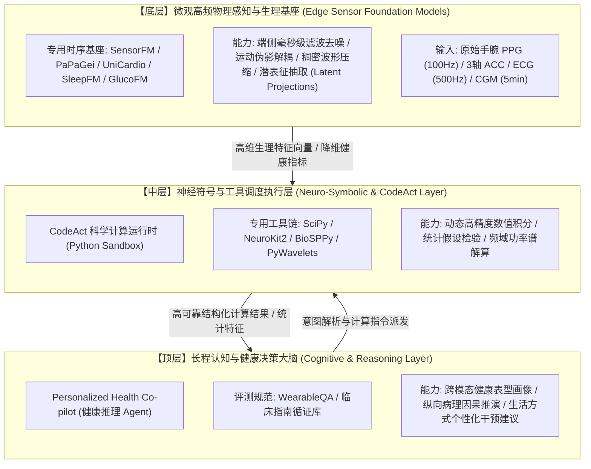

# 可穿戴健康推理与生理大语言模型深度解析 (Wearable Health Reasoning & Physiological LLMs)

> **导读**：随着智能手表、连续血糖仪（CGM）等消费级与临床设备的普及，个人健康时序正从“孤立的瞬时生理读数”演化为“长达数年的全生命周期纵向轨迹”。传统的生理基础模型（如 PaPaGei、SensorFM、GlucoFM）解决了高频物理波形的表征压缩与单点预测问题；然而，面对用户对病理因果归因、多模态联动分析与个性化生活干预的深层诉求，学术界与工业界于 2025–2026 年迎来了**“从信号级表征（Representation）向认知级健康推理（Health Reasoning）”**的重大范式跃迁。
>
> 本专题深度解构 Meta **WearableQA**（arXiv 2026）与 Yang AI Lab **HEARTS**（ICML 2026）两大基石工作，剖析为何纯 LLM 无法“生啃”高频原始波形，并揭示下一代可穿戴 AI 的核心演进形态——**“底层专有生理基座 + 中层 CodeAct/DSP 工具调度 + 顶层健康推理 Agent”**的三层分工体系。

---

## 📑 目录

- [1. 范式跃迁：为什么仅靠“生理表征学习”还远远不够？](#1-范式跃迁为什么仅靠生理表征学习还远远不够)
- [2. 破除迷思：为什么纯 LLM 无法端到端“生啃”底层高频波形？](#2-破除迷思为什么纯-llm-无法端到端生啃底层高频波形)
- [3. Meta WearableQA (2026) —— 真实世界长程健康推理权威基准](#3-meta-wearableqa-2026--真实世界长程健康推理权威基准)
  - [3.1 真实用户长程多模态数据画像](#31-真实用户长程多模态数据画像)
  - [3.2 $2 \times 2$ 分类学空间与 16 种题型设计](#32-2-times-2-分类学空间与-16-种题型设计)
  - [3.3 双重锚定框架 (Dual-Grounding Framework)](#33-双重锚定框架-dual-grounding-framework)
  - [3.4 14 种主流模型评测对比与失败模式](#34-14-种主流模型评测对比与失败模式)
- [4. Yang AI Lab HEARTS (ICML 2026) —— 全谱系生理时序四层认知推理金字塔](#4-yang-ai-lab-hearts-icml-2026--全谱系生理时序四层认知推理金字塔)
  - [4.1 评测全景图谱：跨越 20 种模态与 16 大开源库](#41-评测全景图谱跨越-20-种模态与-16-大开源库)
  - [4.2 四层分层认知推理阶梯 (Hierarchical Capabilities)](#42-四层分层认知推理阶梯-hierarchical-capabilities)
  - [4.3 关键实证发现与“解毒”结论](#43-关键实证发现与解毒结论)
  - [4.4 CodeAct Agent 与神经符号协同范式](#44-codeact-agent-与神经符号协同范式)
- [5. 终局架构：三层可穿戴健康 AI 技术栈 (Hierarchical AI Stack)](#5-终局架构三层可穿戴健康-ai-技术栈-hierarchical-ai-stack)
- [6. 核心论文与开源资源导航](#6-核心论文与开源资源导航)

---

## 1. 范式跃迁：为什么仅靠“生理表征学习”还远远不够？

过去五年，可穿戴生理信号模型主要遵循**单点预测与表征学习范式**：
*   **任务形式**：输入长为 $T$ 的生理信号片段，预测下一时刻的数值 $X_{t+1}$（回归），或判别当前片段是否属于某一特定病理类别（如房颤、睡眠呼吸暂停）。
*   **评测指标**：均方根误差（RMSE）、平均绝对误差（MAE）、分类准确率（Accuracy / F1-score）。

然而，在真实世界的临床健康与个人生活管理中，用户与医生需要的并不是孤立的数字预测，而是具备**生物医学可解释性与因果链条的综合推理**：

$$
\text{“为什么我昨晚静息心率升高了 10 BPM，且深睡减少了 40 分钟？”}
$$

要解答这一问题，系统不仅需要感知到数值的异常突变，更需要跨模态、跨尺度地联合审视：
1. **多指标协同检验**：白天是否有剧烈运动或超负荷心肺活动（$\text{VO}_2\text{max}$ / METs）？就寝前是否有暴饮暴食导致夜间血糖持续维持在高位？
2. **长程个体基线比对**：与过去 30 天的个人昼夜节律基线相比，这一波动是否属于统计学显著偏移？
3. **临床病理机制归因**：究竟是肌肉疲劳恢复期、自主神经交感兴奋，还是急性上呼吸道感染的早期前驱反应？
4. **个性化前瞻干预**：今天是否应该停止计划中的半程马拉松训练？是否需要加强水分补给并复测体温？

> [!NOTE]
> **从 1.0 到 2.0 的本质区别**：
> 基础模型（1.0）负责将混沌高噪的物理信号提炼为**高纯度的生理语义表征（Physiological Representations）**；而健康推理大模型（2.0）则负责在这些表征与现实世界医学知识库之间建立**因果推理与行动决策桥梁（Clinical Reasoning & Actionable Interventions）**。

---

## 2. 破除迷思：为什么纯 LLM 无法端到端“生啃”底层高频波形？

随着生成式 AI 的爆发，部分研究曾尝试将连续物理信号直接数值序列化（如转化为字符串文本），送入通用大语言模型中进行自回归生成。然而，在真实可穿戴高频生理信号场景下，这一做法面临着严峻的物理与算法壁垒：

### 2.1 Token 爆炸与计算复杂度平方灾难
- 智能手表原始 PPG 采样率通常为 25～100 Hz，单导联 ECG 达到 250～1000 Hz。
- 仅单通道 100 Hz 信号，佩戴 **1 小时** 即产生 $360,000$ 个浮点采样点；佩戴一天将产生近 **1000 万个点**。
- 即便使用最长上下文的大语言模型，直接以文本格式输入数百个采样点就会消耗数千 Token，在注意力机制 $\mathcal{O}(N^2)$ 计算复杂度下，端侧计算与云端推理成本均不可承受。

### 2.2 字节级分词 (BPE Tokenization) 对物理量纲的毁灭
- 通用 LLM 采用的 BPE / SentencePiece 分词算法基于文本子词频次统计构建。
- 面对连续浮点数（如 `128.45` 与 `128.49`），分词器极易将其拆解为随机的 Token 碎片（如 `["128", ".4", "5"]`）。
- 这种离散切分不仅**彻底破坏了连续实数的拓扑几何距离与物理量纲（mV, BPM, mg/dL）**，而且在密集数值计算中会诱发严重的数字幻觉。

### 2.3 信号处理物理归纳偏置（Inductive Bias）的彻底缺失
- 生理波形处理极其依赖**局部波形形态学特征、周期平移不变性与频域动力学先验**：
  - 手腕光电脉搏波（PPG）在跑步高动态下的运动伪影，必须依靠 3 轴加速度计（ACC）在 1～3.5 Hz 频段内的谐波碰撞消除算法；
  - 心电（ECG）诊断依赖微秒级 QRS 波群的斜率、ST 段压低微变及 P-R 间期。
- 标准的自注意力机制是一种弱假设的集合映射，完全缺乏频域带通滤波（Bandpass）、小波多尺度分解或状态空间方程等物理约束。

### 2.4 HEARTS 揭示的“启发式作弊陷阱 (Heuristic Shortcuts)”
Yang AI Lab 在 **HEARTS** 基准中对 10 余种前沿 LLM 进行高频时序端到端生成测试，发现了惊人的失败模式：
- **复制粘连（Copying）**：模型在预测后续波形时，往往直接重复前几个周期的局部波形；
- **朴素线性插值（Linear Interpolation）**：在遇到缺失值补全时，倾向于连一条直线，完全丢失了微观的高频生理震荡信息；
- **频率敏感性断崖**：随着信号频率从 1 Hz 升至 100 Hz 及以上，模型表现呈断崖式下跌，且与通用文本推理能力（MMLU）几乎无正相关。

---

## 3. Meta WearableQA (2026) —— 真实世界长程健康推理权威基准

- **论文**: *WearableQA: A Benchmark for Health Reasoning over Real-World Wearable Data* (arXiv:2609.05405)
- **机构**: Meta AI / Reality Labs
- **发布时间**: 2026 年 9 月

```text
               ┌─────────────────────────────────────────────────────────────┐
               │           WearableQA 数据源 (200 名真实用户)                │
               │  - 500 天纵向连续记录 (16 维每日生理/运动/睡眠聚合指标)       │
               │  - 17 维临床实验室血液生化生化面板 (HbA1c, 胰岛素等)         │
               │  - 人口统计学 (年龄/性别/BMI) + 群体大样本分位数参考        │
               └──────────────────────────────┬──────────────────────────────┘
                                              │
                      ┌───────────────────────┴───────────────────────┐
                      ▼                                               ▼
      ┌───────────────────────────────┐               ┌───────────────────────────────┐
      │   Data Reasoning (数据计算)   │               │   Health Reasoning (健康推理) │
      │ - 纵向时序趋势统计与突变检测   │               │ - 疾病风险评估与生理机制分析  │
      │ - 异常值持续时长与基线恢复期  │               │ - 鉴别性推理与多表型分型      │
      │ - 单指标统计 vs 跨指标关联    │               │ - 循证医学指南干预与个性化推荐│
      └───────────────────────────────┘               └───────────────────────────────┘
```

### 3.1 真实用户长程多模态数据画像
WearableQA 摒弃了实验室合成数据，从真实世界大规模可穿戴队列中抽样筛选了 **200 名深度佩戴用户**，每位用户拥有长达 **500 天** 的密集纵向记录：
1. **心血管健康 (Cardio-Fitness)**：静息心率（RHR）、心率变异性（HRV, rMSSD）、最大摄氧量（$\text{VO}_2\text{max}$）。
2. **日常活动与体能 (Activity & Energy)**：总步数、动态活动卡路里消耗、基础代谢率（BMR）、高强度运动时长、运动均值心率、代谢当量（METs）。
3. **睡眠生理架构 (Sleep Architecture)**：总睡眠时长、睡眠效率、深睡比例（Deep Sleep %）、快速动眼期比例（REM %）、就寝作息规律性指数（Bedtime Regularity）。
4. **自主神经与代谢压力**：全天平均压力水平（Stress Score）。
5. **临床血液生物标志物 (Blood Biomarkers)**：匹配 17 项临床化验指标（空腹血糖、糖化血红蛋白 HbA1c、高敏 C 反应蛋白 hs-CRP、血脂四项、空腹胰岛素等）。
6. **人群分位数参考 (Cohort Reference Percentiles)**：来自数十万人大样本群体的五大核心指标年龄-性别正态分位数。

### 3.2 $2 \times 2$ 分类学空间与 16 种题型设计
WearableQA 创新性地构建了双轴交叉的评测矩阵，共涵盖 **4,084 道 10 选 1 单选题**（随机瞎猜概率基线仅为 10%）：

| 维度轴 | 子类型 | 核心考察要求 | 典型问题示例 |
| :--- | :--- | :--- | :--- |
| **推理类型 (Reasoning)** | **Data Reasoning**<br>(数据计算, 2.7k 题) | 纯粹基于可穿戴传感器时序数字的计算推导（均值、极值、恢复时长、偏离度）。 | *“该用户在过去 6 个月中，静息心率超过个人基线 1.5 倍标准差的平均恢复天数是多少？”* |
| **推理类型 (Reasoning)** | **Health Reasoning**<br>(健康推理, 1.4k 题) | 必须结合临床病理学生理机制、疾病前兆与医学指南进行因果归纳。 | *“结合该用户长期的步数骤降、HRV 持续走低与空腹胰岛素水平，最可能提示哪种代谢综合征表型？”* |
| **信号维度 (Complexity)** | **Single-metric**<br>(单指标, 1.7k 题) | 仅针对单一通道生理时序开展深层纵向分析。 | *“分析用户的深睡百分比变化轨迹并归纳其作息演变。”* |
| **信号维度 (Complexity)** | **Cross-metric**<br>(多模态关联, 2.4k 题) | 跨模态检验多个生理系统之间的动态响应与非线性耦合。 | *“评估运动消耗量增长对随后两晚睡眠效率及次日静息心率的滞后抑制效应。”* |

### 3.3 双重锚定框架 (Dual-Grounding Framework)
为了在数千道长程健康题目中建立确定性的真实标签（Ground Truth），Meta 提出了双重锚定体系：
1. **文献循证锚定 (Literature-grounded)**：由临床医生与生物医学专家从顶级医学期刊（NEJM、Lancet、Nature Medicine）及指南（AHA、ADA）中提取出具有确定因果结论的生理相互作用规则。
2. **群体统计显著锚定 (Population-grounded)**：利用超大规模真实穿戴数据库，通过严格的双侧统计假设检验（$p < 0.001$，且效应量 Cohen's $d > 0.5$），确保题目的因果关系在真实人群分布中具有统计显著性，杜绝伪相关。

### 3.4 14 种主流模型评测对比与失败模式
在 14 种最前沿大模型上的实测结果呈现出极大的能力分化：

```text
WearableQA 准确率全景横评 (随机基线 = 10%)
┌────────────────────────────────────────────────────────────────────────┐
│ Gemini-3.1-Pro        ████████████████████████████████████  72.9%      │
│ GPT-4o / GPT-5 系列   █████████████████████████████████     68.4%      │
│ Claude-Opus-4.6       ███████████████████████████████       64.1%      │
│ Llama-3.3-70B         ████████████████████████              48.2%      │
│ Mistral-Small-3.1     ██████████████                        31.5%      │
│ Gemma-3-12B           ██████████                            22.8%      │
│ Chance Baseline (10%) ████                                  10.0%      │
└────────────────────────────────────────────────────────────────────────┘
```

> [!WARNING]
> **评测暴露的致命短板**：
> 1. **长程上下文退化**：当输入完整的 500 天日常数据表格（数万 Token）时，开源中小模型的定位注意力严重发散，对早期（如第 100 天）和中期突变的捕捉率下降了 40% 以上。
> 2. **数据计算弱于逻辑推理**：绝大多数模型在“纯数据趋势计算（Data Reasoning）”上的得分反而低于“医学知识推理（Health Reasoning）”——大模型背诵医学概念容易，但在几百行连续数字中精确执行“窗口统计与阈值计数”却频频出现计算失误。

---

## 4. Yang AI Lab HEARTS (ICML 2026) —— 全谱系生理时序四层认知推理金字塔

- **论文**: *HEARTS: Benchmarking LLM Reasoning on Health Time Series* (arXiv:2603.06638 / ICML 2026)
- **团队**: Yang AI Lab (Sirui Li, Yuzhe Yang 等联合 MIT / Harvard 研究团队)
- **资源**: 📄 [Paper](https://arxiv.org/abs/2603.06638) | 🌐 [Website](https://yang-ai-lab.github.io/HEARTS/) | 💻 [GitHub](https://github.com/yang-ai-lab/HEARTS)

```text
                       ▲
                      / \
                     /   \
                    / 4.  \   Deduction (演绎归纳)
                   /       \  - 时间排序、纵向轨迹因果演变、预后推断
                  /─────────\
                 /    3.     \   Generation (时序生成)
                /             \  - 预测、缺失值插补、跨模态波形转换
               /───────────────\
              /       2.        \   Inference (状态推断)
             /                   \  - 生理事件定位、疾病诊断分类、体征判别
            /─────────────────────\
           /          1.           \   Perception (底层感知)
          /                         \  - 信号级特征提取、形态学测量、峰值检测
         └───────────────────────────┘
```

### 4.1 评测全景图谱：跨越 20 种模态与 16 大开源库
HEARTS 是目前涵盖最广、多模态异构性最高的健康时序综合评测基准：
- **16 个权威数据集**：包括心血管手术监护库 VitalDB、全套多导睡眠监测 SHHS、手腕活动监测 Capture24、连续血糖动态代谢 CGMacros、嗓音与呼吸病理 Bridge2AI Voice 等。
- **20 种生理模态**：覆盖 ECG、EEG、PPG、EMG、连续无创血压（CNBP）、CGM 血糖、阻抗呼吸波、眼动注视轨迹、步态加速度、咳嗽与语音音频等。
- **跨越极限物理尺度**：采样率从超低频（每日聚合）纵贯至超高频（48 kHz 呼吸音）；序列长度从数十个点延展至超过 1,000,000 点。

### 4.2 四层分层认知推理阶梯 (Hierarchical Capabilities)

1. **Perception (底层感知与特征提取)**:
   - 考察模型对微观波形形态的度量能力。
   - 任务：检测 PPG 脉搏重搏切迹（Dicrotic Notch）、计算心电 QRS 波群时长、提取音频声门周期基频。
2. **Inference (生理事件定位与受试者分类)**:
   - 考察局部的医学分类与异常检测能力。
   - 任务：房颤（AFib）发作事件精确定位、睡眠呼吸暂停阶段分类、神经肌肉退行性步态识别。
3. **Generation (时序生成、插补与跨模态映射)**:
   - 考察时序动力学的重建能力。
   - 任务：根据前序血糖预测餐后轨迹、电极脱落期间的阻抗插补、由外周 PPG 跨模态合成诊断级 ECG。
4. **Deduction (时间演化因果推断与纵向推演)**:
   - 考察最高阶的时间因果推理与病理演变逻辑。
   - 任务：判断不同生理并发症发生的时间因果先后顺序、基于数月生理指标演化推演心血管发病风险轨迹。

### 4.3 关键实证发现与“解毒”结论
HEARTS 进行了详尽的大规模实证对照实验，给出了数条颠覆盲目乐观的技术洞见：
1. **专有时序基座全面碾压直接 LLM 推理**：
   在 Perception 与 Generation 等硬核数字信号任务中，哪怕是参数量仅 1.5M 的轻量级专有时序模型（如 PaPaGei、MOMENT），其精度与相关性也大幅超越数百亿参数的通用多模态 LLM。
2. **通用推理能力的弱相关性**：
   模型在普通文本基准上的强悍推理实力，无法直接迁移到健康时序领域。健康时序包含深厚的生物物理因果规律，缺乏生理先验的通用大模型容易陷入无休止的虚假模式匹配。
3. **模态表示形式的影响仅停留在绝对数值**：
   将时序绘制成折线图（Vision-LLM）、将数值序列转化为原始文本字符串、或者经过 Patch 离散化，只会在绝对分值上产生平移，**不同生理任务之间的相对难易梯度在各种输入形式下高度一致**。

### 4.4 CodeAct Agent 与神经符号协同范式
针对纯 LLM 计算脆弱的问题，HEARTS 深入探索了 **CodeAct Agent** 范式：
- **核心机制**：LLM 不再直接输出计算结果或逐点波形，而是担任**指挥中枢（Task Planner）**，通过自主编写并动态执行 Python 代码，调用成熟的数字信号处理与生物信息库：
  - 调用 `scipy.signal` 执行巴特沃斯带通滤波与功率谱密度（PSD）估计；
  - 调用 `neurokit2` / `wfdb` 进行心电 R 波峰值探测与 HRV 频域指标（LF/HF）解算；
  - 调用 `pandas` 执行移动窗口分位数统计与双变量格兰杰因果检验。
- **效果飞跃**：在引入 CodeAct 机制后，大模型在复杂 Data Reasoning 和 Perception 任务上的达标率平均提升了 **38.6%**，彻底克服了浮点数乘除法和时序积分运算的幻觉问题。

---

## 5. 终局架构：三层可穿戴健康 AI 技术栈 (Hierarchical AI Stack)

结合 WearableQA 与 HEARTS 的前沿探索，可穿戴生理信号基础模型与大语言模型的融合架构已清晰呈现出**三层分工演化体系**：



### 三层协同工作流剖析：
1. **端侧毫秒级感知 (Layer 1)**：在智能手表或连续监测贴片端侧，运行参数量仅数兆的轻量级生理基础模型（如 PaPaGei 或 GlucoFM）。它们以极低功耗实时消除运动伪影，完成生理波形的对齐与连续潜特征抽取，将海量原始物理采样点压缩为高质量的生理健康指标时序。
2. **符号与精确计算执行 (Layer 2)**：当用户发起深层健康问询或系统触发异常预警时，中层计算引擎利用 CodeAct 或工具调用协议，严格计算统计显著性检验（$p$ 值）、多变量时延互相关与特征分布漂移，保证数据层面百分之百的数值正确性。
3. **云端跨模态长程推理 (Layer 3)**：顶层大语言模型接收由中层和底层沉淀下的结构化健康画像（类似于 WearableQA 中的 500 天多模态档案），融合用户的电子病历、生化血检指标与全球权威临床指南，以温暖、严谨且富有同理心的自然语言输出深度的健康因果分析与前瞻性行动方案。

---

## 6. 核心论文与开源资源导航

| 项目 / 论文名称 | 机构 / 团队 | 发表情况 | 核心贡献与定位 | 代码 / 权重 / 数据集资源 |
| :--- | :--- | :--- | :--- | :--- |
| **WearableQA** | Meta AI | arXiv 2026.09 | 首个基于 200 名真实用户 500 天纵向记录的健康推理基准（4,084 题） | 📄 [arXiv:2609.05405](https://arxiv.org/abs/2609.05405) |
| **HEARTS** | Yang AI Lab | ICML 2026 | 全谱系 20 种模态、四层认知金字塔的生理时序大模型评测体系 | 📄 [arXiv:2603.06638](https://arxiv.org/abs/2603.06638) <br> 🌐 [Website](https://yang-ai-lab.github.io/HEARTS/) <br> 💻 [GitHub](https://github.com/yang-ai-lab/HEARTS) <br> 🤗 [Hugging Face](https://huggingface.co/datasets/yang-ai-lab/HEARTS) |
| **Mental-LLM** | 华盛顿大学 / 微软 | ACM IMWUT 2024 | 探索大语言模型基于智能手机与手环多源传感器时序预测心理健康与抑郁表型 | 📄 [DOI:10.1145/3643540](https://doi.org/10.1145/3643540) |
| **CodeAct** | UIUC | ICML 2024 | 驱动大模型通过自主编写与执行 Python 代码进行科学计算的核心 Agent 范式 | 💻 [GitHub CodeAct](https://github.com/xingyaoww/code-act) |
