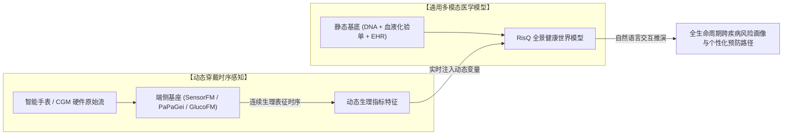

# 系统级多模态健康世界模型深度解析 (Universal Health & Cross-Disease Foundation Models)

> **导读**：长期以来，临床医学和生物医药 AI 陷于“单一疾病孤岛（Disease Silos）”的局限——预测心血管疾病用一套评分，预测糖尿病用另一套模型，将人体复杂系统生硬割裂。然而，人类疾病的发生是**遗传底色、微观生化代谢、宏观生活方式与时间推移**共同作用的非线性动力学过程。
>
> 2026 年，由慕尼黑工业大学（TUM）、德国国家人工智能与生物计算中心（Helmholtz Munich）、QuantCo、哈佛大学及斯坦福医学 AIMI 等联合研发的 **RisQ**（medRxiv / Research Square 2026），首次在近 **75 万真实人类队列（UK Biobank + All of Us）** 上验证了**“人类健康全景跨疾病共享潜在结构（Shared Structure of Human Health）”**，并实现了通过**自然语言提示词（Promptable Query）**在全生命周期内对任意疾病进行零样本风险推演。
>
> 本专题深度解构 RisQ 的技术架构、跨疾病缩放定律（Scaling Law），并系统探讨穿戴时序（SensorFM/OpenMHC）如何作为动态遥测探针接入这一“通用医学世界模型”。

---

## 📑 目录

- [1. 范式革命：从“单一疾病孤岛”到“人体健康世界模型”](#1-范式革命从单一疾病孤岛到人体健康世界模型)
- [2. RisQ 核心架构与技术创新 (TUM / Helmholtz / Harvard, 2026)](#2-risq-核心架构与技术创新-tum--helmholtz--harvard-2026)
  - [2.1 75 万人跨国别双中心超大规模队列验证](#21-75-万人跨国别双中心超大规模队列验证)
  - [2.2 四大生命模态与时间跨度联合建模](#22-四大生命模态与时间跨度联合建模)
  - [2.3 自然语言提示词驱动的零样本风险查询 (Promptable Risk Modeling)](#23-自然语言提示词驱动的零样本风险查询-promptable-risk-modeling)
  - [2.4 医学风险领域的“缩放定律 (Scaling Law)”首次证明](#24-医学风险领域的缩放定律-scaling-law首次证明)
  - [2.5 微观单基因功能缺失突变 (LoF) 的跨系统病理锚定](#25-微观单基因功能缺失突变-lof-的跨系统病理锚定)
- [3. 静态医学组学与动态可穿戴时序的共生关系](#3-静态医学组学与动态可穿戴时序的共生关系)
- [4. 核心模型横向对比矩阵](#4-核心模型横向对比矩阵)
- [5. 总结与未来展望](#5-总结与未来展望)

---

## 1. 范式革命：从“单一疾病孤岛”到“人体健康世界模型”

过去半个世纪，流行病学和医学统计学构建风险预测模型的核心范式是**“专病专模（Single-Disease Silos）”**：
- **心血管专科**：Framingham 评分、SCORE2 风险图表（基于血压、胆固醇、吸烟状况预测 10 年心梗中风风险）；
- **内分泌专科**：FINDRISC 糖尿病风险评分；
- **神经专科**：多基因风险评分（PRS）结合载脂蛋白 E（APOE）预测阿尔茨海默病。

```text
传统医学风险范式 (烟囱式孤岛)             现代通用健康世界模型 (RisQ 范式)
┌─────────────────────────┐              ┌─────────────────────────────────────────┐
│ 血压/血脂 ──> 预测心梗  │              │ 🧬 全基因组 (DNA)                       │
├─────────────────────────┤              │ 🧪 临床血液化验 (Biomarkers)            │
│ 血糖/BMI  ──> 预测糖尿病│              │ 🏥 电子病历轨迹 (EHR / ICD-10)          │──> 【统一潜在结构空间】
├─────────────────────────┤              │ ⌚ 穿戴体动/心率时序                    │         │
│ 认知测试  ──> 预测痴呆  │              └─────────────────────────────────────────┘         ▼
└─────────────────────────┘                                                自然语言 Prompt 零样本查询:
每个模型参数互不连通、信息严重割裂!                                        "评估未来 5 年心衰与肾衰发病概率"
```

### 传统做法的深层致命缺陷：
1. **割裂了人体生理的系统性联动**：例如，慢性肾脏病（CKD）、2 型糖尿病（T2D）与动脉粥样硬化心血管疾病（ASCVD）在病理生理学上属于相互促进的“心肾代谢综合征（Cardiorenal Metabolic Syndrome）”。单一疾病模型无法捕捉这种跨器官的共同级联反应。
2. **缺乏时间与疾病的开放式泛化能力**：若要评估“患者未来 3 年”或“某种罕见并发症”，传统模型必须重新清洗数据、重新拟合 Cox 回归系数；面对训练集未见过的疾病，模型完全丧失推断能力。

**RisQ 提出的核心假说**：
人类所有后天复杂疾病的易感性，并非离散独立的随机事件，而是**遗传变异、内环境生化稳态、日常生理代谢与多器官共病随时间累积的“共享潜在结构（Shared Structure of Human Health）”**。只要数据模态与疾病跨度足够丰富，AI 完全可以学习到这一统一的通用生命表征。

---

## 2. RisQ 核心架构与技术创新 (TUM / Helmholtz / Harvard, 2026)

- **论文**: *Learning the shared structure of human health across diseases, modalities, and time*
- **机构**: 慕尼黑工业大学 (TUM)、亥姆霍兹慕尼黑中心 (Helmholtz Munich)、QuantCo、哈佛大学、帝国理工、斯坦福医学 AIMI
- **主要作者**: Paul Hager, Benedikt Roth, Daniel Rueckert, Fabian J. Theis 等
- **论文链接**: 📄 [DOI: 10.64898/2026.07.07.26357373](https://doi.org/10.64898/2026.07.07.26357373)

```text
                                  自然语言 Prompt 接口
           "What is the risk of developing Heart Failure in the next 5 years?"
                                            │
                                            ▼
┌──────────────────────────────────────────────────────────────────────────────────┐
│                             RisQ 统一健康表征编码器                              │
│                                                                                  │
│   🧬 全基因组多变异     🧪 血液生化化验      🏥 长程电子病历      ⌚ 穿戴体动/节律时序  │
│   (Genetics / LoF)      (30+ Lab Panels)    (ICD-10 编码轨迹)   (Axivity AX3 时序)  │
│          │                     │                   │                     │       │
│          └─────────────────────┼───────────────────┼─────────────────────┘       │
│                                ▼                   ▼                             │
│                 【多尺度跨模态交互注意力 (Multimodal Cross-Attention)】           │
│                                            │                                     │
│                                            ▼                                     │
│                 【跨疾病·跨模态·跨时间 共享潜在表征向量 z】                       │
└────────────────────────────────────────────┬─────────────────────────────────────┘
                                             │
                                             ▼
┌──────────────────────────────────────────────────────────────────────────────────┐
│                             全谱系时间生存风险解码器                             │
│  - 任意时间窗 (Prediction Horizons: 1年, 3年, 5年, 10年, 15年)                   │
│  - 零样本疾病泛化 (Generalization to unseen diseases across ICD-10 chapters)     │
└──────────────────────────────────────────────────────────────────────────────────┘
```

### 2.1 75 万人跨国别双中心超大规模队列验证
RisQ 彻底摆脱了单中心过拟合的质疑，在两个全球顶级的超大型队列上进行了极具说服力的跨人群验证：
1. **预训练与内部验证集 —— UK Biobank (英国生物样本库)**：
   - **488,170 名受试者**，随访时间长达 10～15 年；
   - 融合全外显子测序、全基因组 SNP 芯片、30 余项临床生化全套检验、10 万人的 7 天手腕连续高频加速度计（Axivity AX3）、以及覆盖全英 NHS 系统的住院与死亡登记电子病历。
2. **零样本跨国别独立外推集 —— All of Us (美国跨族裔精准医学队列)**：
   - **257,538 名受试者**；
   - **完全不进行模型权重微调（Zero-shot without retraining）**，直接将预训练好的 RisQ 应用于美国多族裔队列；
   - 实测证明：RisQ 在所有疾病门类的风险预测准确率（C-index / AUC-PR）上，全方位击败了专病 Cox 比例风险模型、多任务多头网络以及主流的表格大模型。

### 2.2 四大生命模态与时间跨度联合建模
RisQ 将个体的异构医疗数据投影至统一的跨模态空间：
- **静态先验模态 (Genetics)**：全外显子功能缺失变异（LoF）与常见致病突变，决定了个体先天的疾病易感底色；
- **动态生化内环境 (Biomarkers)**：空腹血糖、HbA1c、肝肾功能酶学、血脂四项、C-反应蛋白等数值；
- **纵向临床事件时序 (EHR)**：按时间戳排列的历史诊断（ICD-10）、手术记录、药物处方事件；
- **全天候生活方式时序 (Wearable Accelerometry)**：从手腕穿戴设备中提取的日间宏观身体活动强度、静坐时长分布及昼夜节律稳定性。

### 2.3 自然语言提示词驱动的零样本风险查询 (Promptable Risk Modeling)
与传统模型输出一个固定维度的分类 Logits 不同，RisQ 将大语言模型的 **Prompt 理念与生存分析（Survival Analysis）** 完美融合：
- 医生或系统可以通过自然语言指令直接向模型发起查询：
  $$\text{Query: "Estimate the risk of Type 2 Diabetes within } \Delta t = 5 \text{ years."}$$
- 模型内部将自然语言疾病描述映射到疾病本体论（Disease Ontology / SNOMED CT / ICD-10 空间），与受试者的多模态潜在表征 $\mathbf{z}$ 及预测时域 $\Delta t$ 进行跨注意力对齐，实时解算出对应的累积发病风险曲线。
- **未见疾病零样本泛化**：即便某一罕见病在训练阶段没有充沛的独立正样本，RisQ 也能凭借其与已知疾病在基因和生化潜空间上的相关性，给出高可信度的风险推演。

### 2.4 医学风险领域的“缩放定律 (Scaling Law)”首次证明
自然语言大模型的爆发得益于 Scaling Law。RisQ 在生物医学领域首次严格验证了跨疾病的 Scaling 现象：
- **定理实证**：随着模型联合训练的**疾病种类数量由数十种扩展至上百种、融合的数据模态增加、以及覆盖的时间跨度拉长**，模型在任一特定单病种（如心肌梗死、阿尔茨海默病）上的风险预测精度**单调递增**！
- **信息正向迁移（Positive Information Transfer）**：这证明不同疾病间不仅没有发生传统多任务学习中的“负迁移（Negative Transfer / 任务竞争）”，反而因为揭示了底层生物物理的共通机制，使模型对人体生理全景的理解越发深邃。

### 2.5 微观单基因功能缺失突变 (LoF) 的跨系统病理锚定
为了杜绝 AI 的“黑盒幻觉”，研究团队将 RisQ 学到的潜空间表征与人类全基因组单基因突变进行了严格的反向因果映射：
- 模型自动定位出了多个经典致病基因突变对全谱系疾病风险的联动影响：
  - *HBB*（血红蛋白亚基 $\beta$ 基因突变）：直接关联多系统微循环障碍与缺血性贫血综合征；
  - *LDLR*（低密度脂蛋白受体突变）：精确投射至早发家族性高胆固醇血症及全周期心血管早亡事件；
  - *SLC22A12*（尿酸转运蛋白）：揭示高尿酸血症与痛风及继发性心肾代谢衰竭的级联关系；
  - *CASR*（钙敏感受体）：跨模态链接骨质疏松与原发性甲状旁腺功能亢进的远期轨迹。

---

## 3. 静态医学组学与动态可穿戴时序的共生关系

在 RisQ 构筑的“通用医学全景世界模型”中，可穿戴生理时序占据了不可替代的生态位：

| 数据特性 | 组学与医院临床数据 (Genetics & EHR) | 可穿戴生理时序 (Wearables: PPG/ECG/ACC/CGM) |
| :--- | :--- | :--- |
| **采样频次** | 极度低频、稀疏（DNA 一生测一次，体检半年/一年一次） | **全天候 24/7 连续流（秒级、分钟级持续刷新）** |
| **状态表征** | 先天底色、器官已有病变终点、静态生化快照 | **人体实时生理遥测（动态内环境平衡与自主神经响应）** |
| **在架构中的角色** | 构成 RisQ 的**“个体先天基线与临床参考锚点”** | 构成 RisQ 的**“实时生理呼吸通道与动态演变探针”** |



> [!TIP]
> **技术共生结论**：  
> 没有静态多组学与电子病历，可穿戴模型就无法外推到几十万人的重大临床终点；  
> 而没有可穿戴设备的高频连续遥测，通用医学大模型就会沦为“只能在生病后复盘的静态离线系统”。

---

## 4. 核心模型横向对比矩阵

| 对比维度 | Google SensorFM (2026) | Stanford OpenMHC (2026) | RisQ (TUM/Helmholtz, 2026) | Meta WearableQA (2026) |
| :--- | :--- | :--- | :--- | :--- |
| **核心定位** | 硬件传感器级微观物理基座 | 超大规模开源穿戴基座与评测 | **系统级全景健康世界模型** | 长程生活方式健康推理考卷 |
| **受试者规模** | >500 万人 (Fitbit 设备) | 11,894 人 (My Heart Counts) | **745,708 人 (UKB + All of Us)** | 200 人 (500天高深度记录) |
| **涵盖核心模态** | PPG + ACC + EDA + Temp | 19 维穿戴通道 + 169 维 HealthKit | **全基因组 + 生化验血 + EHR + 穿戴** | 16 维穿戴日常指标 + 17 项血检 |
| **时间尺度** | 毫秒级、秒级至单日 | 分钟级至跨年连续生活 | **1年、5年、10年至全生命周期** | 500 天纵向连续日常指标 |
| **交互与调用** | 输出特征 Embedding 供下游微调 | 运行三条统一 Benchmark 赛道 | **自然语言 Prompt 查询任意疾病风险** | 10 选 1 深度选择题评测 |
| **开源状态** | 🔴 商业闭源 | 🟢 代码/基准开源 (Dataverse/HF) | 📄 顶刊在审 (开源复现协议) | 🟢 题目/协议论文公开 |

---

## 5. 总结与未来展望

RisQ 代表了生物医学大模型正在经历的**重大质变**：从“专病专模的小作坊”，跃升为“在多组学、跨模态大数据中学习生命系统共同演化规律的通用基座”。

在可穿戴生理模型的研究谱系中，RisQ 指明了底层物理信号模型（如 SensorFM、OpenMHC、PaPaGei）的**终极价值输出端**——不仅仅是在手表上给出一个心率或步数数字，而是将这些动态物理特征持续注入到生命健康全景世界模型中，真正实现对高血压、心衰、糖尿病、癌症及神经退行性疾病的**全生命周期超早期因果预警与生活方式干预闭环**。
